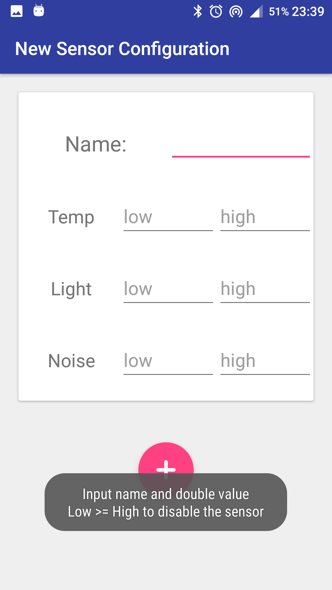
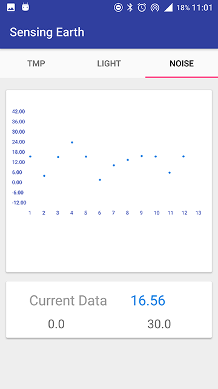

# SensingEarth
An IoT system, final project of the Embedded Computing System course. It contains two parts: Android app and CC3200 board. On the CC3200 board part the sensors gather the data of the specific environment, The Andorid app part show the sensors' data that user cares about.

[中文介绍](README_CN.md)

## Features

* Stable socket connection between app and CC3200 board
* User can create sensor configuration to specify using which sensor(s) and the corresponding threshold
* Send user selected sensor configuration to connected CC3200 board
* Get the sensors data and show the datas with Point chart realtimely
* Alert user and send feedback info when detected abnormal datas
* User can change sensor configuration any time to care about defferent datas
* (Partially) Material Design

## Demo

 

## TODO

* [ ] iOS version app
* [ ] Server side

### Refactor:

* [ ] Material Design: add Material transition animations and Activity animations
* [ ] Improve project structure
* [ ] No specific sensor
* [ ] Add database(sensor configuration, sensor data)

## Copyright

The Android app part is developed by [me](https://github.com/notgao), and the CC3200 board part is developed by my roommate @范坤杰 .  All rights reversed.